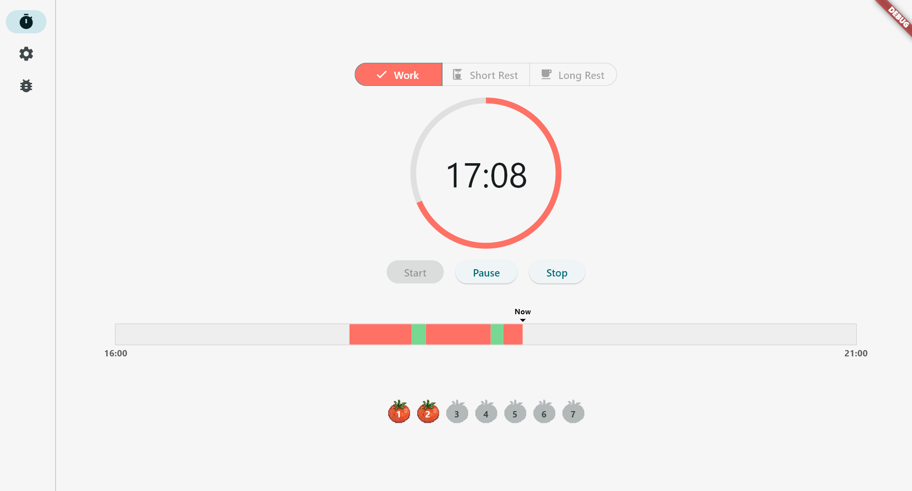
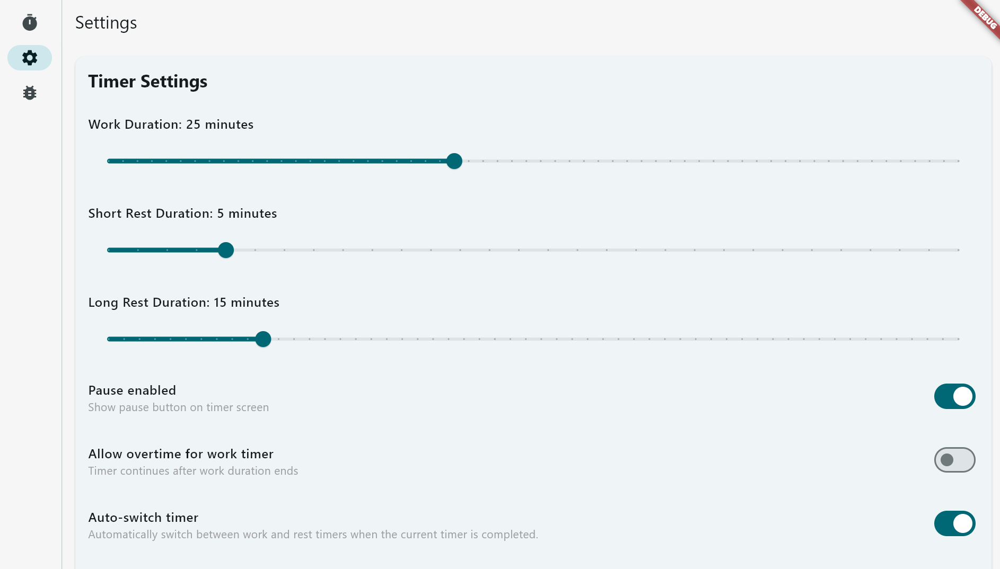
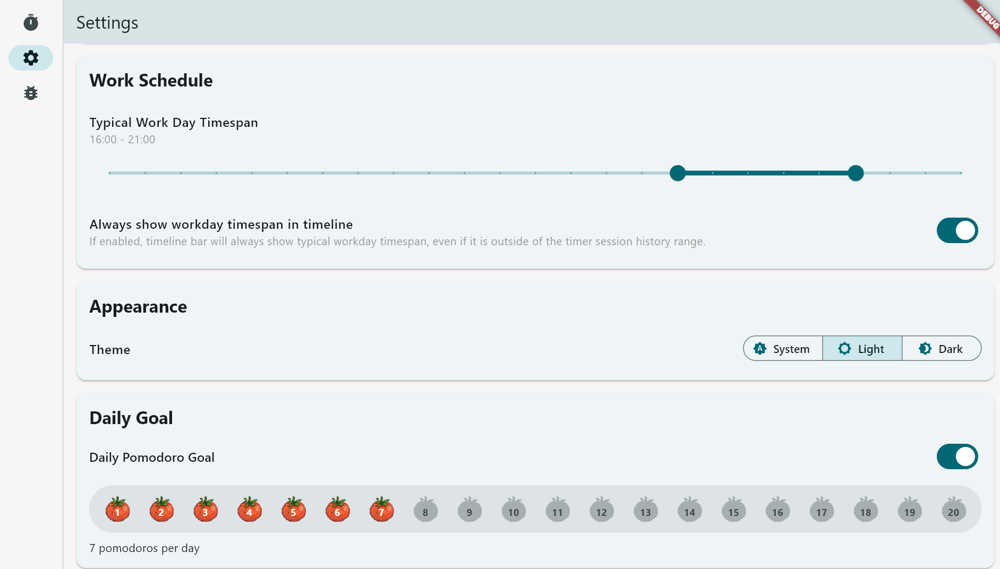

# Pomodoro Timer

In addition to its utility, I created this [Pomodoro](https://en.wikipedia.org/wiki/Pomodoro_Technique) timer app to
- Learn about Dart and Flutter (no prior experience)
- Learn about how AI can assist in getting over the initial obstacle when learning new stuff.

The code base could be refactored some, as I've learned lessons on the way (this being my first project with the technology), but not gone back and refactored all of the code.

# Features
- Work timer and short & long rest timers
- Timer lengths are user definable
- Start, pause (which can be disabled) and stop the timer
- Timeline showing today's history of timer sessions
- Timer sessions are stored to filesystem
- Daily goal (how many Pomodoros per day)
- Light & dark themes
- Auto-switch timer, Auto start rest/work timer.
- Allow work timer overtime
- Audio notification on timer end

# Screen shots

## Timer

## Settings 

